## Kodai Matsudaira

Ph.D. student at Tokai University / Software Engineer, Nexreal LLC

- Research: measuring the state of people using XR so they can collaborate safely across the real and the virtual
- Engineering: full-stack software development through Nexreal LLC

<picture>
  <source media="(prefers-color-scheme: dark)" srcset="./profile/top-langs-dark.svg">
  
</picture>
